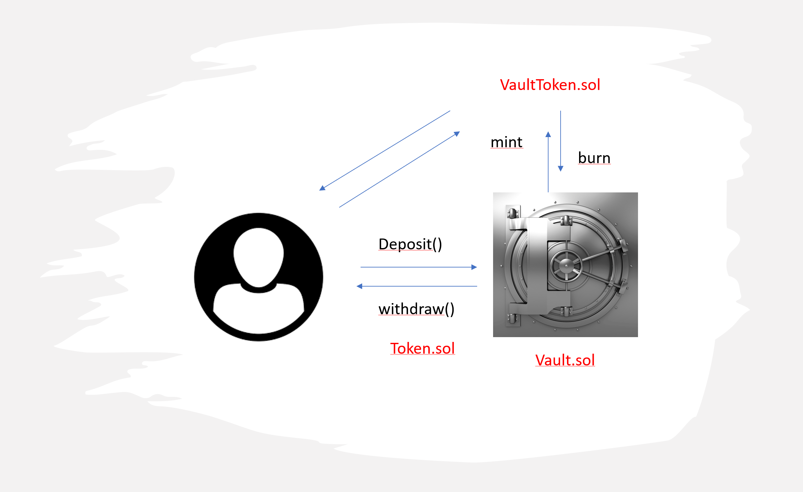

# Ethereum Vault

- [Ethereum Vault](#ethereum-vault)
  - [1. About](#1-about)
  - [2. Project description](#2-project-description)
  - [3. Smart contracts](#3-smart-contracts)
  - [4. Install](#4-install)
  - [5. Running tests](#5-running-tests)
  - [6. Test suite output](#6-Test-suite-output)


## 1. About

This repository contains the source code for a Solidity based VAULT smart contract on the Layer One

## 2. Project description

This Project is an implementation of a vault that allows a user to deposit an ERC20 token in exchage of a ProofToken provided by the vault.
The the conversion rate ProofToken/ Token increases by time. So basicly the user is staking his token to get some rewards  
The users are allowed to withdraw their Token by providing the ProofToken.



## 3. Smart contracts
The smart contracts in the project are:

`VaultToken.sol`

- implements the business logic of the Vault


`Token.sol`

- ERC20 standard token
- This is the Token to deposit and withdraw

`VaultToken.sol`

- ERC20 standard token
- implemens `mint` and `burn`

## 4. Install

Truffle is required to deploy and test this project.
They can be installed by running:

```
$ npm install -g truffle

```

Clone the repository and install dependencies:

```
$ npm install
```

## 5. Running tests on Truffle

This project includes a test suite based in Truffle/Mocha.

To run test on Truffle :

```
truffle test 
```

### 6. Test suite output

The following is the expected test result:

```javascript
Compiling your contracts...
===========================
> Compiling ./contracts/Migrations.sol
> Compiling ./contracts/Token.sol
> Compiling ./contracts/VaultContract.sol
> Compiling ./contracts/VaultToken.sol
> Compiling @openzeppelin/contracts/access/Ownable.sol
> Compiling @openzeppelin/contracts/token/ERC20//utils/SafeERC20.sol
> Compiling @openzeppelin/contracts/token/ERC20/ERC20.sol
> Compiling @openzeppelin/contracts/token/ERC20/IERC20.sol
> Compiling @openzeppelin/contracts/token/ERC20/extensions/IERC20Metadata.sol
> Compiling @openzeppelin/contracts/utils/Address.sol
> Compiling @openzeppelin/contracts/utils/Context.sol
> Artifacts written to /tmp/test--2605-pSg4iSnWdLmr
> Compiled successfully using:
   - solc: 0.8.12+commit.f00d7308.Emscripten.clang


  Contract: Vault
    ✓ should deploy all the smart contract
     First Case : user deposits THT token and receives PTK tokens
      ✓ should update user balance of THT and PTK
      ✓ should fire a 'Deposit' event
      ✓ should change user balance in the vault
    Second case : user deposit PTK in order to withdraws THT tokens
      ✓ should fire a 'Withdraw' event
      ✓ user token balance should be zero
      ✓ should update user balance of THT and PTK


  7 passing (7s)

```
